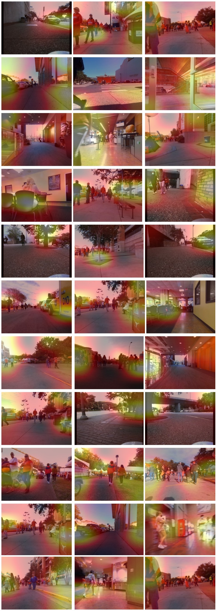
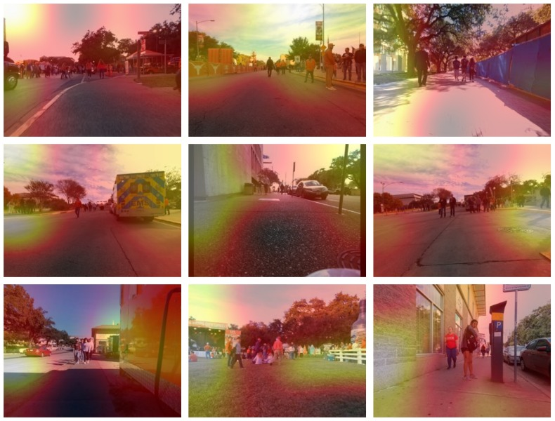

[](https://opensource.org/licenses/MIT)

The official PyTorch implementation of "Learning Where to See for Navigation: A Self-Supervised Vision-Action Pre-Training Approach".

<p align="center">
  
</p>

## Installation
Main libraries:
* [PyTorch](https://www.pytorch.org/): as the main ML framework
* [Comet.ml](https://www.comet.ml): tracking code, logging experiments
* [OmegaConf](https://omegaconf.readthedocs.io/en/latest/): for managing configuration files

First create a virtual env for the project. 
```bash
python3 -m venv .venv
source .venv/bin/activate
```

Then install the latest version of PyTorch from the [official site](https://www.pytorch.org/). Finally, run the following:
```bash
pip install -r requirements.txt
```
To set up Comet.Ml follow the [official documentations](https://www.comet.ml/docs/).

## Dataset
Please follow [this](docs/data_parser.md) guide to download the dataset.

## Training
To run pretext training (edit [config](VANP/conf/config_pretext.yaml) first):
```bash
./run.sh train
```

## Sample Outputs
Unlike ImageNet weights which primarily focus on a single salient object within the environment, regardless of its distance, 
the proposed VANP demonstrates greater accuracy in attending to multiple nearby 
objects that directly influence the robot's trajectory by activating regions corresponding to 
pedestrians, cars, trash cans, doors, and other relevant elements.



However, the model sometimes fails to pay attention to the important regions affecting the trajectory. 
We can see activations in the sky or lots of unnecessary activations:



## Acknowledgements
Thanks for [GNM](https://github.com/PrieureDeSion/drive-any-robot), [VICreg](https://github.com/facebookresearch/vicreg/tree/main), and [Barlow](https://github.com/facebookresearch/barlowtwins) papers for making their code public.
