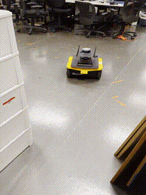

# [VANP: Learning Where to See for Navigation with Self-Supervised Vision-Action Pre-Training](https://arxiv.org/abs/2403.08109)
[](https://opensource.org/licenses/MIT)

[Mohammad Nazeri](https://mhnazeri.github.io/), Junzhe Wang, Amirreza Payande, [Xuesu Xiao](https://cs.gmu.edu/~xiao/)
<hr style="border: 2px solid gray;"></hr>

We present VANP, a Self-Supervised Vision-Action model for visual navigation pre-training approach. Instead of detecting salient objects that are beneficial for tasks
such as classification or detection, VANP learns to focus only on specific visual regions that are relevant to the navigation task.

<p align="center">
  
</p>

To achieve this, VANP uses a history of visual observations, future actions, and a goal image for self-supervision, and embeds them using two small Transformer Encoders. Then, VANP maximizes the information between the embeddings by using a mutual information maximization objective function. 

This repository contains three components: (1) the code to [parse](https://github.com/mhnazeri/VANP/blob/main/VANP/utils/parser.py) bag files from [MuSoHu](https://cs.gmu.edu/~xiao/Research/MuSoHu/) and [SCAND](https://www.cs.utexas.edu/~xiao/SCAND/SCAND.html), (2) [train code](https://github.com/mhnazeri/VANP/blob/a1af2922edf1a910359f2976c236bb459a3ad202/VANP/train_pretext.py#L114) for the pretext task, and (3) [train](https://github.com/mhnazeri/VANP/blob/a1af2922edf1a910359f2976c236bb459a3ad202/VANP/train_pretext.py#L361) and [validation](https://github.com/mhnazeri/VANP/blob/a1af2922edf1a910359f2976c236bb459a3ad202/VANP/train_pretext.py#L423) code for downstream navigation task using the pre-trained model.

#### Updates
* Jul 29, 2024: fix bug in PositionalEncoding
* Jul 26, 2024: added more augmentation and gradient accumulation for better performance.
* Jul 26, 2024: code cleanup, and general bug fixes.

## Applying on Your Data
* If you want to apply VANP on your dataset, please make sure that your data does not contain static sequences (sequences without change between frames) for better results. Please read the limitation section of the paper.
* Removing the action head is possible, but generally not advised, at least have it for warmup.
* You can change the hyperparameters in the [config](VANP/conf/config_pretext.yaml) file, and the [level of augmentations](https://github.com/mhnazeri/VANP/blob/a1af2922edf1a910359f2976c236bb459a3ad202/VANP/model/dataloader.py#L89) in the [dataloader](https://github.com/mhnazeri/VANP/blob/main/VANP/model/dataloader.py) to improve the results.
* You can add embedding spaces from other models such as [Segment Anything](https://ai.meta.com/sam2/) and [Depth Anything](https://github.com/DepthAnything/Depth-Anything-V2) in [this section](https://github.com/mhnazeri/VANP/blob/a1af2922edf1a910359f2976c236bb459a3ad202/VANP/train_pretext.py#L334) of the code to enrich the embedding space even with more information.

## Installation
Main libraries:
* [PyTorch](https://www.pytorch.org/): as the main ML framework
* [Comet.ml](https://www.comet.ml): tracking code, logging experiments
* [OmegaConf](https://omegaconf.readthedocs.io/en/latest/): for managing configuration files

First create a virtual env for the project. 
```bash
python3 -m venv .venv
source .venv/bin/activate
```

Then install the latest version of PyTorch from the [official site](https://www.pytorch.org/). Finally, run the following:
```bash
pip install -r requirements.txt
```
To set up Comet.Ml follow the [official documentations](https://www.comet.ml/docs/).

## Dataset
We used [MuSoHu](https://cs.gmu.edu/~xiao/Research/MuSoHu/) and [SCAND](https://www.cs.utexas.edu/~xiao/SCAND/SCAND.html). Please follow [this](docs/data_parser.md) guide to download and parse the datasets.

## Model Training
<p align="center">
  
</p>

To run pretext and downstream training, first edit the [config](VANP/conf/config_pretext.yaml) file with proper directory addresses and change of hyperparameters as you see fit, then run:
```bash
./run.sh train
```

[//]: # (## Sample Outputs)

[//]: # (Unlike ImageNet weights which primarily focus on a single salient object within the environment, regardless of its distance, )

[//]: # (the proposed VANP demonstrates greater accuracy in attending to multiple nearby )

[//]: # (objects that directly influence the robot's trajectory by activating regions corresponding to )

[//]: # (pedestrians, cars, trash cans, doors, and other relevant elements.)

[//]: # ()
[//]: # (![Sample outputs]&#40;docs/samples/sample1.jpg&#41;)

[//]: # ()
[//]: # (However, the model sometimes fails to pay attention to the important regions affecting the trajectory. )

[//]: # (We can see activations in the sky or lots of unnecessary activations:)

[//]: # ()
[//]: # (![Sample outputs]&#40;docs/samples/sample2.jpg&#41;)

## Acknowledgements
Thanks for [GNM](https://github.com/PrieureDeSion/drive-any-robot), [VICreg](https://github.com/facebookresearch/vicreg/tree/main), and [Barlow](https://github.com/facebookresearch/barlowtwins) papers for making their code public.

## Citation
If you find the code helpful, please cite this work:
```
@article{nazeri2024vanp,
  title={VANP: Learning Where to See for Navigation with Self-Supervised Vision-Action Pre-Training},
  author={Nazeri, Mohammad and Wang, Junzhe and Payandeh, Amirreza and Xiao, Xuesu},
  journal={arXiv preprint arXiv:2403.08109},
  year={2024}
}
```
